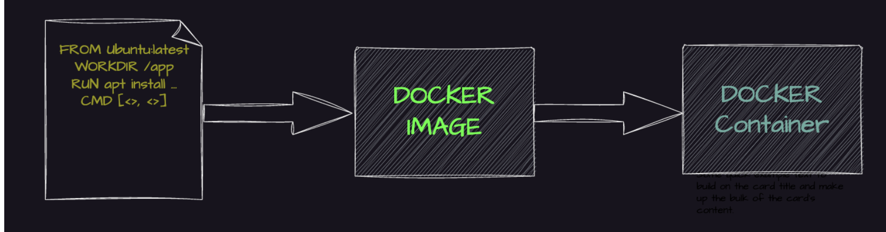
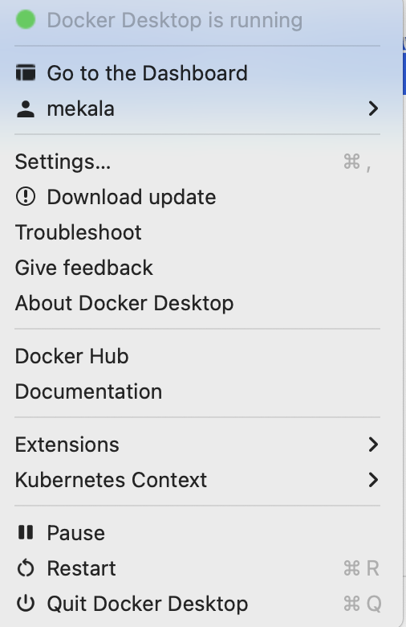

# Docker Zero to Hero

## What is Docker?

Docker is an open platform for building, shipping, and running applications. Docker enables you to separate your applications from your infrastructure so you can deliver software quickly. With Docker, you can manage your infrastructure in the same ways you manage your applications.

## What is Docker Platform?

Docker provides the ability to package and run an application in a loosely isolated environment called a container. The isolation and security lets you run many containers simultaneously on a given host. **Containers are lightweight and contain everything needed to run the application** (libraries, application runtime, dependencies), so you don't need to rely on what's installed on the host.

## Difference Between Docker and Virtual Machine


Containers and virtual machines are both technologies used to isolate applications and their dependencies, but they have some key differences:

**Resource Utilization**: Containers share the host operating system kernel, making them lighter and faster than VMs. VMs have a full-fledged OS and hypervisor, making them more resource-intensive, which is a waste of resources (CPU, memory, etc.) compared to Docker.

**Portability**: Containers are designed to be portable and can run on any system with a compatible host operating system. VMs are less portable as they need a compatible hypervisor to run.

**Security**: VMs provide a higher level of security as each VM has its own operating system and can be isolated from the host and other VMs. Containers provide less isolation, as they share the host operating system.

**Management**: Managing containers is typically easier than managing VMs, as containers are designed to be lightweight and fast to deploy.

## Docker Architecture


Docker uses a client-server architecture. The Docker client talks to the Docker daemon, which does the heavy lifting of building, running, and distributing your Docker containers. The Docker client and daemon can run on the same system, or you can connect a Docker client to a remote Docker daemon. The Docker client and daemon communicate using a REST API, over UNIX sockets or a network interface.

## Docker Lifecycle

We can use the above image as reference to understand the lifecycle of Docker.

There are three important components:

- **docker build** → builds docker images from Dockerfile
- **docker run** → runs container from docker images  
- **docker push** → push the container image to public/private registries to share the docker images



## Understanding the Docker Components

### Docker Daemon

The Docker daemon (dockerd) listens for Docker API requests and manages Docker objects such as images, containers, networks, and volumes. A daemon can also communicate with other daemons to manage Docker services.

### Docker Client

The Docker client (docker) is the primary way that many Docker users interact with Docker. When you use commands such as `docker run`, the client sends these commands to dockerd, which carries them out. The docker command uses the Docker API. The Docker client can communicate with more than one daemon.

### Docker Desktop

Docker Desktop is an easy-to-install application for your Mac, Windows or Linux environment that enables you to build and share containerized applications and microservices. Docker Desktop includes the Docker daemon (dockerd), the Docker client (docker), Docker Compose, Docker Content Trust, Kubernetes, and Credential Helper.

### Docker Registries

A Docker registry stores Docker images. Docker Hub is a public registry that anyone can use, and Docker is configured to look for images on Docker Hub by default. You can even run your own private registry.

When you use the `docker pull` or `docker run` commands, the required images are pulled from your configured registry. When you use the `docker push` command, your image is pushed to your configured registry.

### Docker Objects

When you use Docker, you are creating and using images, containers, networks, volumes, plugins, and other objects. This section is a brief overview of some of those objects.

### Dockerfile

Dockerfile is a file where you provide the steps to build your Docker Image.

### Images

An image is a read-only template with instructions for creating a Docker container. Often, an image is based on another image, with some additional customization. For example, you may build an image which is based on the ubuntu image, but installs the Apache web server and your application, as well as the configuration details needed to make your application run.

You might create your own images or you might only use those created by others and published in a registry. To build your own image, you create a Dockerfile with a simple syntax for defining the steps needed to create the image and run it. Each instruction in a Dockerfile creates a layer in the image. When you change the Dockerfile and rebuild the image, only those layers which have changed are rebuilt. This is part of what makes images so lightweight, small, and fast, when compared to other virtualization technologies.

## Installation of Docker

**Reference Link:** [Docker Installation](https://docs.docker.com/get-started/get-docker/)

Since I'm using macOS, I have installed Docker Desktop for Mac with Apple Silicon. Based on your operating system you can install accordingly (Windows, Linux, etc.).

After downloading the package, double click and install it, then drag and drop Docker into Applications. We can see that Docker Desktop is running as per the screenshot attached below. Then you can log in to Docker Desktop and you will be able to see your images and containers if they exist.



## How to Dockerize a Project?

```bash
mkdir day-02
cd day-02

# Clone the sample project
git clone https://github.com/docker/getting-started-app.git
cd getting-started-app/

# Create Dockerfile
touch Dockerfile
```

Using the text editor of your choice, paste the content below into the Dockerfile:

```dockerfile
FROM node:18-alpine 
WORKDIR /app 
COPY . . 
RUN yarn install --production 
CMD ["node", "src/index.js"] 
EXPOSE 3000
```

## Details About Dockerfile

- **FROM node:18-alpine** → Linux-based Alpine OS
- **WORKDIR /app** → Work directory which we will execute inside the container
- **COPY . .** → Copies from source local path to inside container
- **RUN yarn install --production** → Installs yarn packages which our project requires
- **CMD ["node", "src/index.js"]** → Executes the container command required to start the application
- **EXPOSE 3000** → Exposes the port to access the app over the public internet

## How to Build the Docker Image and Push to Docker Hub

### Build the Docker Image

Build the docker image based on application code and Dockerfile:

```bash
docker build -t day02 .
```

Verify the image has been created and stored locally:

```bash
docker images
```

### Push to Docker Hub

1. Create a public repository on `hub.docker.com`
2. Login to Docker Hub:
   ```bash
   docker login
   ```
   It will ask for username and password - provide the same and it will connect to Docker Hub.

3. Tag the image:
   ```bash
   docker tag day02:latest mekala/nodejs-test:latest
   ```
   (`day02:latest` is local image tag and `mekala/nodejs-test:latest` is repository tag)

4. Check available images:
   ```bash
   docker images
   ```

5. Push the image to public registry (Docker Hub):
   ```bash
   docker push mekala/nodejs-test:latest
   ```

### Common Docker Commands

```bash
# Pull the image from Docker Hub to local system
docker pull mekala/nodejs-test:latest

# Run the container with local and container ports
docker run -dp 3000:3000 mekala/nodejs-test:latest

# Execute into the container (replace with actual container ID)
docker exec -it f72f59a5b12f sh

# Check all running containers status
docker ps

# List all containers (running or not)
docker ps -a

# Check application container logs
docker logs <container_id>

# Stop the container
docker stop <container_id>

# Remove the container
docker rm <container_id>

# Remove the image 
docker image rm <image_name>
```

## Multi-Stage Docker Build

### Setup

```bash
mkdir day-03
git clone https://github.com/piyushsachdeva/todoapp-docker
cd todoapp-docker
```

### Create Multi-Stage Dockerfile

Create a `Dockerfile` with the following content:

```dockerfile
FROM node:18-alpine AS installer
WORKDIR /app
COPY package*.json ./
RUN npm install 
COPY . .
RUN npm run build

FROM nginx:latest AS deployer
COPY --from=installer /app/build /usr/share/nginx/html
```

### Dockerfile Explanation

1. **FROM node:18-alpine AS installer** → Uses the official Node.js 18 Alpine-based image. Alpine is a lightweight Linux distribution, reducing the final image size. `AS installer` names this build stage (used later in multi-stage copying).

2. **WORKDIR /app** → Sets `/app` as the working directory inside the container.

3. **COPY package*.json ./** → Copies `package.json` and `package-lock.json` into the container. If dependencies don't change, Docker reuses the cached npm install layer, making builds faster.

4. **RUN npm install** → Installs project dependencies inside the container.

5. **COPY . .** → Copies the entire source code into the container.

6. **RUN npm run build** → Runs the build command (e.g., for a React, Vue, or Angular project).

7. **FROM nginx:latest AS deployer** → Uses the latest NGINX image for serving static files. This second stage does not include Node.js, making the final image smaller and optimized for production.

8. **COPY --from=installer /app/build /usr/share/nginx/html** → Copies the built static files from the installer stage (`/app/build`) to the default NGINX web root (`/usr/share/nginx/html`). This allows NGINX to serve the frontend without Node.js in the final container.

### Build and Run

```bash
docker build --load -t multistage .
docker images
docker tag multistage:latest mekala/multistage:latest 
docker login -u username mekala
docker push mekala/multistage:latest
docker run -it -dp 3000:80 multistage
docker ps
```

**Note:** NGINX listens on port 80 inside the container. The `docker run -p 3000:80` option maps container port 80 to host port 3000. You can access the container at `localhost:3000`, even without `EXPOSE 3000` in your Dockerfile.

### How Docker Works Internally

1. When you run `docker build`, Docker reads the `Dockerfile` line by line and uses your current folder as the build context.

2. Each line in a Dockerfile creates a new image layer. These layers are saved as compressed files inside Docker's storage.

3. Docker uses union file systems like OverlayFS. It stacks all layers from a single container file system.

4. When you run `docker run`, Docker takes the image and adds a writable layer on top - that becomes a container.

5. The container is just a process on your machine. It runs with its own isolated environment using Linux namespaces and cgroups.

6. **Namespaces** isolate process ID, hostnames, network, mount points, and shared memory. **Cgroups** control CPU, RAM, and I/O usage.

7. Docker gives a container a virtual Ethernet interface. By default, it's connected to the `docker0` bridge.

8. If you use `-p` to map ports, Docker sets iptables rules. This forwards traffic from your host to the container.

9. The Docker daemon (`dockerd`) runs in the background. It handles builds, containers, images, volumes, and networks.

10. The Docker CLI talks to the daemon using REST API. It connects over a Unix socket or TCP.

11. Docker volumes live outside the container layer. They're stored in `/var/lib/docker/volumes` and survive container restarts.

12. Any change inside the container is temporary. If you delete the container, the changes are gone unless saved to an image or volume.

13. Docker uses content-based hashes for layers. This makes layers reusable, cacheable, and easy to share.

14. When you push an image, Docker checks which layers are already in the registry. It only uploads what's missing.

### Docker Networking

Networking allows containers to communicate with each other and with the host system. Containers run isolated from the host system and need a way to communicate with each other and with the host system.

Containers have networking enabled by default, and they can make outgoing connections.

**Bridge:** The default network driver. If you don't specify a driver, this is the type of network you are creating. Bridge networks are commonly used when your application runs in a container that needs to communicate with other containers on the same host.

**Host:** Removes network isolation between the container and the Docker host, and uses the host's networking directly. (Not supported on macOS/Windows)

**None:** Completely isolates a container from the host and other containers. `none` is not available for Swarm services.

**Overlay:** Overlay networks connect multiple Docker daemons together and enable Swarm services and containers to communicate across nodes. This strategy removes the need to do OS-level routing.

**Macvlan:** Macvlan networks allow you to assign a MAC address to a container, making it appear as a physical device on your network. The Docker daemon routes traffic to containers by their MAC addresses. Using the macvlan driver is sometimes the best choice when dealing with legacy applications that expect to be directly connected to the physical network, rather than routed through the Docker host's network stack.

#### Example Commands

```bash
# Start a busybox container as root
docker run -itd --user root busybox sh
docker exec -it <container_id> sh

> **Note:** While ping  inside container i.e `ping google.com` If you get 'ping: permission denied', use --privileged as below.

docker run -itd --privileged busybox sh
docker exec -it <container_id> sh

# List networks
docker network ls
# Inspect the bridge network
docker network inspect bridge
# Create a bridge network
docker network create my-bridge
# Run containers on the custom bridge network
docker run --network my-bridge --name container1 -d nginx
docker run --network my-bridge --name container2 -d alpine sleep 3600
docker exec -it container2 ping container1

# Run with host network (Linux only)
docker run --network host -d nginx
```

> **Note:** On macOS and Windows, the `--network host` option is not supported because Docker Desktop uses a virtualized environment and does not provide the host network driver. This option only works natively on Linux. When you run `docker run --network host ...` on macOS or Windows, the container will exit or fail because it cannot use the host network mode.

### Docker Compose

Docker Compose is a tool for defining and running multi-container applications. It streamlines development and deployment by allowing you to manage services in a single YAML file.

**Why use Compose?**

- **Simplified control:** Define and manage multi-container apps in one YAML file, streamlining orchestration and replication.
- **Efficient collaboration:** Shareable YAML files support smooth collaboration between developers and operations, improving workflows and issue resolution.
- **Rapid application development:** Compose caches the configuration used to create a container. When you restart a service that has not changed, Compose re-uses the existing containers, allowing quick environment changes.
- **Portability across environments:** Compose supports variables in the Compose file, enabling customization for different environments or users.

**How Compose works:**
With Docker Compose, you use a YAML configuration file (the Compose file) to configure your application's services, then create and start all the services from your configuration with the Compose CLI.

> **Note:** The `version` key is obsolete in Compose v2+ and can be omitted.

Refer: `docker-zero-to-hero/docker-compose/docker-compose.yaml`

## Docker Compose Commands

```bash
cd DevOps/docker-zero-to-hero/backend
npm install
```

> **Note:** A basic backend package has been generated with Express and an entry point (index.js). Dependencies are installed and ready for use in your Docker Compose setup. You can now run docker compose up

```bash
docker compose up
docker compose down
docker compose logs
docker compose ps
```

### Docker Best Practices

**Use Multi-stage Builds:** Reduce final image size and attack surface by separating build dependencies from runtime dependencies.

**Choose Small, Official Base Images:** Start with minimal base images (e.g., Alpine) and use official images from trusted sources when available to ensure security and maintainability.

**Minimize Layers:** Combine related RUN commands using && to reduce the number of layers and improve build cache efficiency.

**Leverage Build Cache:** Order Dockerfile commands from least to most frequently changing to maximize cache hits.
Use .dockerignore: Exclude unnecessary files and directories from the build context to speed up builds and reduce image size.

**Pin Base Image Versions:** Specify exact image tags (e.g., node:20.11.0-alpine) instead of latest to ensure reproducibility.

**Prefer COPY over ADD:** COPY is generally preferred as it's more explicit and avoids potential issues with ADD's tar extraction and URL handling.

**Run as Non-Root User:** Create a dedicated user and group within the image and run the application as this unprivileged user to enhance security.

**Scan Images for Vulnerabilities:** Integrate image scanning tools into your CI/CD pipeline to identify and address security vulnerabilities early. `Ex:` trivy, clair and snyk etc.

**Reference:** [Docker Best Practices](https://docs.docker.com/build/building/best-practices/)
---

## Summary

This guide covers Docker from basics to advanced concepts including:
- Docker fundamentals and architecture
- Installation and setup
- Creating and managing Docker images
- Multi-stage builds for optimized production images
- Internal workings of Docker
- Docker networking
- Docker compose
- Docker best practices

For more advanced topics, refer to the official [Docker Documentation](https://docs.docker.com/).
